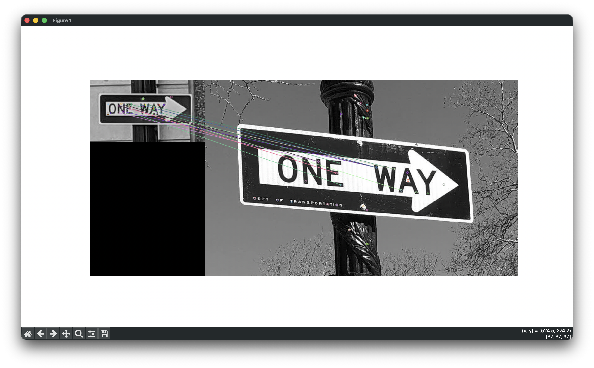

# 🔍 Feature Matching using SIFT in Python

A Computer Vision project demonstrating feature detection, descriptor extraction, and feature matching between two images using OpenCV's SIFT (Scale-Invariant Feature Transform) algorithm.

This project replicates the workflow of MATLAB's Feature Matching example and visualizes corresponding keypoints between two images of the same object captured from different viewpoints.



---

## 📌 Overview

Feature Matching is a fundamental Computer Vision technique used in:

- Object Recognition
- Image Registration
- Panorama Stitching
- Visual SLAM
- Augmented Reality
- Image Retrieval Systems

In this project, SIFT is used to detect distinctive keypoints in two images of a **ONE WAY** traffic sign. Feature descriptors are extracted and matched using OpenCV's Brute Force Matcher, followed by Lowe's Ratio Test to eliminate ambiguous matches.

---

## ⚙️ Methodology

### 1. Image Preprocessing

The input images are loaded and converted to grayscale.

```python
img1 = cv2.imread("assets/oneway1.png", cv2.IMREAD_GRAYSCALE)
img2 = cv2.imread("assets/oneway2.png", cv2.IMREAD_GRAYSCALE)
```

### 2. Feature Detection

SIFT identifies stable and distinctive keypoints such as corners, edges, and textured regions.

```python
sift = cv2.SIFT_create(nfeatures=50)
kp1, des1 = sift.detectAndCompute(img1, None)
kp2, des2 = sift.detectAndCompute(img2, None)
```

### 3. Descriptor Extraction

Each keypoint is represented by a numerical descriptor that captures the local image structure around that point.

### 4. Feature Matching

Descriptors are matched using OpenCV's Brute Force Matcher.

```python
bf = cv2.BFMatcher()
matches = bf.knnMatch(des1, des2, k=2)
```

### 5. Lowe's Ratio Test

To remove ambiguous matches, Lowe's Ratio Test is applied.

```python
for m, n in matches:
    if m.distance < 0.75 * n.distance:
        good_matches.append(m)
```

A match is accepted only when the nearest neighbor is significantly better than the second nearest neighbor.

### 6. Visualization

Matched keypoints are visualized using:

```python
cv2.drawMatches()
```

The output image displays:

- Detected keypoints
- Matching feature pairs
- Correspondence lines between images

---

## 📊 Results

The algorithm successfully identifies corresponding features between two views of the same traffic sign despite differences in scale, position, and perspective.

Key observations:

- Robust feature detection using SIFT.
- Reliable descriptor matching.
- Reduction of false matches using Lowe's Ratio Test.
- Accurate correspondence visualization between images.

---

## 🛠 Technologies Used

- Python
- OpenCV
- NumPy
- Matplotlib

---

## 📂 Project Structure

```text
Feature-Matching/
│
├── assets/
│   ├── oneway1.png
│   ├── oneway2.png
│   └── feature_matching_result.png
│
├── feature_matching.py
├── requirements.txt
└── README.md
```

---

## 🚀 Installation

Clone the repository:

```bash
git clone https://github.com/yourusername/Feature-Matching.git
cd Feature-Matching
```

Install dependencies:

```bash
pip install opencv-python
pip install opencv-contrib-python
pip install matplotlib
pip install numpy
```

---

## ▶️ Running the Project

```bash
python feature_matching.py
```

---

## 🔄 MATLAB to Python Conversion

| MATLAB | Python |
|----------|----------|
| `imread()` | `cv2.imread()` |
| `im2gray()` | `cv2.IMREAD_GRAYSCALE` |
| `detectSURFFeatures()` | `cv2.SIFT_create()` |
| `selectStrongest()` | `nfeatures=50` |
| `extractFeatures()` | `detectAndCompute()` |
| `matchFeatures()` | `BFMatcher.knnMatch()` |
| `showMatchedFeatures()` | `cv2.drawMatches()` |

---

## 🎯 Learning Outcomes

Through this project, I gained hands-on experience with:

- Feature Detection
- Descriptor Extraction
- Feature Correspondence
- Lowe's Ratio Test
- Image Matching
- OpenCV Computer Vision Workflows
- Translating MATLAB Computer Vision implementations into Python

---

## 📚 References

- OpenCV Documentation: https://opencv.org/
- David Lowe's SIFT Paper: https://www.cs.ubc.ca/~lowe/papers/ijcv04.pdf
- MATLAB Feature Matching Example: https://www.mathworks.com/help/vision/ug/matching-features.html

---

### Author

**Yatharth Gupta**

Computer Science Engineering Student | Computer Vision & AI Enthusiast
